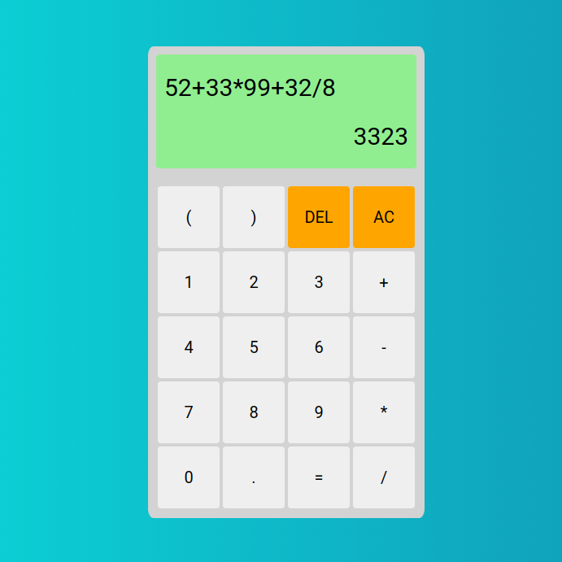

# Non scientific Calculator

## Description
This is a simple non scientific calculator, created using vanilla Javascript, CSS and HTML. The main logic behind the whole application is the computeStorage array which acts as a buffer, storing the users input. When the user presses the enter button, the answer is calculated based on the computeStorage array. Starting from left to right ....... 

## GUI
On the top left corner of the screen the current expression is being displayed.

On the bottom right corner of the screen the answer of the expression is being displayed.

Usage
Use examples liberally, and show the expected output if you can. It's helpful to have inline the smallest example of usage that you can demonstrate, while providing links to more sophisticated examples if they are too long to reasonably include in the README.

