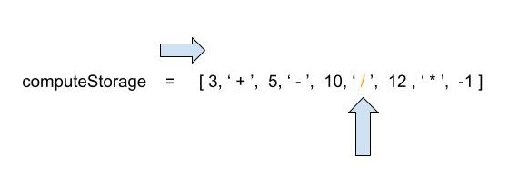
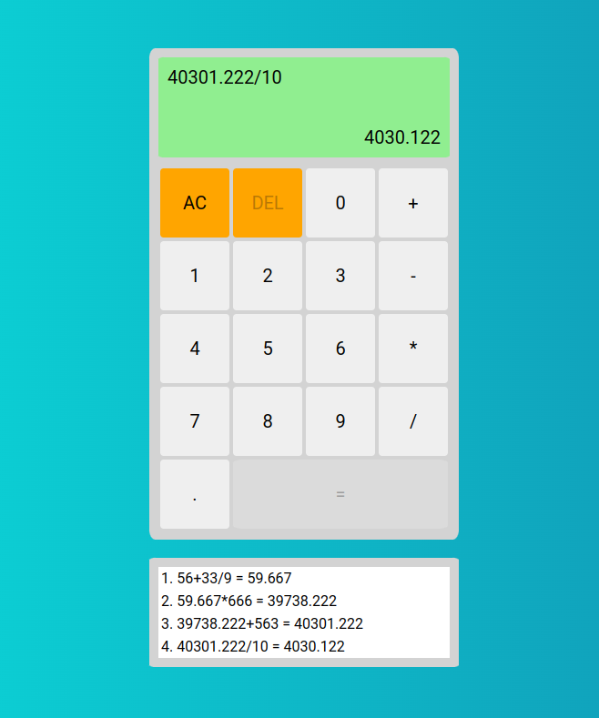

# Simple Calculator

## Description

This is a simple non scientific calculator, created using vanilla Javascript, CSS and HTML.

The main logic behind the whole application is the computeStorage array which acts as a buffer, storing the users input. With my implementation the eval() function is avoided.

When the user presses the equals button, the answer is calculated based on the computeStorage array. Starting from left to right, the compute() function evaluates if multiplications and divisons are in place. If they are found, following the algebraic order of operations, we execute the first avaible multiplication or division. Loop the array until we are left with the expressions result.

## GUI

On the top left corner of the screen the current expression is being displayed.

On the bottom right corner of the screen the answer of the expression is being displayed.

Below the calculator, there is a display showing all past operations.

## Usage

Create the expression you want to calculate by clicking the numbers and operands on the screen and press the equals button.

Starting an operation with / or \* will lead to an error.

Press the AC button to clear the storage.

Press the DEL button to delete the current expression.

When the expression is calculated, contiue your calculations using the current answer by pressing an operand. Clicking any number at this point will update the expression display but no effect will take place.
